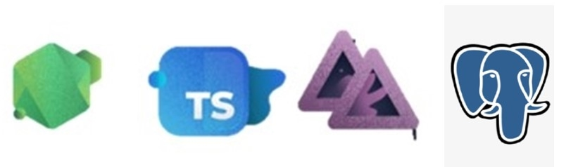

## Escopo

### 

<details>
<summary> Teste Prático - Desenvolvimento Backend  </summary>
<div class="text-justify">

### O Desafio - Criar uma API para gestão de frete de uma transportadora

#### A api consiste em algumas entidades:

##### Motorista - (Motorista que irá efetuar o frete)
O motoristorista pode aceitar o frete de apenas uma transportadora

##### Transportadora - (Empresa que irá disponibilizar o frete)
A transportadora pode disponibilizar diversos fretes
Os fretes precisam ser ordenados por status e data

##### Frete - (Frete disponibilizado peka transportadora)
O cálculo do frete é a soma do KM + volume da carga em KG
R$ 1,60 por km
R$ 2,00 Por kg

##### Veículo - Veículo que irá efetuar o frete
Veículo deve pertencer a um único motorista

##### Tipo de veículo - Tipos de veículos
Os tipos de veículos devem conter os seguintes campos:
Capacidade em kg
Altura do baú
Largura do baú
Comprimento do baú
Peso total do veículo

#### Documentação
No README do projeto explique:

- Passos para execução do projeto.
- Requisitos
- Usar língua inglesa para escrita do código
- Usar NodeJs + TypeScript
- Banco de dados Postgres
- Adicionar swagger
- API RestFull
- Você é livre para utilizar algum framework node ex: Nest
- Você é livre para definir a modelagem e organização das features a serem implementadas.

#### O que será avaliado
- Organização do projeto.
- Simplicidade da implementação.
- Modelagem do Banco de Dados.
- Qualidade do código.
= Utilização correta dos status HTTP (200, 404, 500, etc...) Processo de build.
- Qualidade dos testes (é um diferencial).

#### Dúvidas
- Caso não encontre a sua resposta, sinta-se à vontade para abrir uma issue =]

</div>
</details>

## Projeto
API de Gerenciamento de Veiculos e Motoristas para uma Transportadora realizar cadastrar e realizar fretes, o back-end está contruido em NodeJS usando TypeScript e Adonis5, conectado e armazenado banco de dados relacional (Postgres) usando ORM (Lucid). Utilizando Arquitetura MVC, sem a camada View.

### Linguagens e Frameworks 



### Rodando a aplicação

Baixe ou clone a aplicação em sua máquina, dentro da pasta backend execute o comando:
```bash
node ace serve --watch
```
Aplicação abrirá em na Porta 3333 -> Rotas estão agrupadas, portando a raiz exibirá Hello World por default e métodos estão dentro dos caminhos exibidos no comando list routes:

```bash
node ace list:routes  
```

O teste de API foi feito através o Thunder Client, uma extensão do Visual Studio Code!

A Visualização das tabelas criadas foi atraves do Postgres E pgAdmin (Localmente) e do Bekeeper Studio.

## Criação
### Instalação e Preparação - Ambiente Backend

Use o gerenciador de pacotes node [Adonis](https://docs.adonisjs.com/guides/installation) para iniciar a aplicação e criar as configurações iniciais.

```bash
npm init adonis-ts-app@latest .
```

```bash
node ace serve --watch
```

### Instalação e Preparação - ORM

AdonisJS é um dos poucos frameworks Node.js com suporte de primeira classe para bancos de dados SQL. O Lucid alimenta a camada de dados da estrutura e você deve instalar o pacote separadamente.

```bash
npm i @adonisjs/lucid
```

```bash
npm i pg
```

### Algumas configurações 

Conventional Commits é uma convenção em cima dos commits que fornece um conjunto fácil de regras para criar um histórico de confirmação explícito; o que torna mais fácil escrevê-los e identifica-los. 
```bash
npm i -D git-commit-msg-linter
```

### Ferramentas Utilizadas
- Visual Studio Code
- WSL Ubuntu 20.04LTS
- Node v16.15.1
- npm 8.11.0
- Postgres
- Bekeeper Studio
- Git
- Japa (Test)

### Autor
Jordan Cruz
